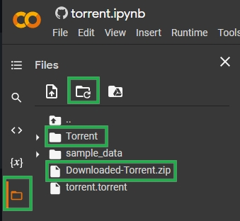
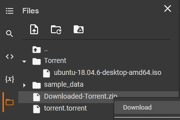
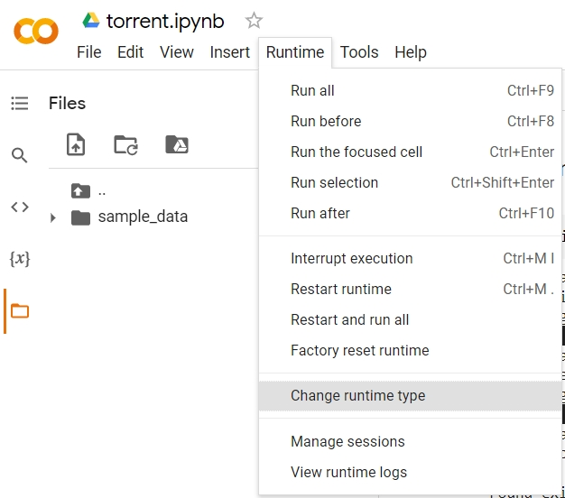

# Download torrent using google colab

Run this python notebook script to download torrent files in Google Colab.

### Purpose

1. Download torrent files where torrent downloading is restricted.
2. Make use of google servers download speed.
3. No installation of torrent softwares.
4. You only need a browser.

### Tutorial

1. Click the `Open in Colab` badge above.
2. Click `Runtime` -> `Run all`
   
   
3. Input the Torrent file link or Magnet link and press `Enter`
   
   
4. Open `Files`. Press folder refresh icon. Your downloaded torrent files should be inside the `Torrent` folder. The zipped file is called `Downloaded-Torrent.zip`
   
   
5. Download the zipped file by pressing right click -> `Download`. You may also download other files seperately.
   
   

### Notes

#### Google Colab files are temporary

One important caveat to remember while using Colab is that the files you upload to it won’t be available forever. Colab is a temporary environment with an idle timeout of 90 minutes and an absolute timeout of 12 hours. This means that the runtime will disconnect if it has remained idle for 90 minutes, or if it has been in use for 12 hours. On disconnection, you lose all your variables, states, installed packages, and files and will be connected to an entirely new and clean environment on reconnecting. [Source](https://neptune.ai/blog/google-colab-dealing-with-files)

#### Increase colab disk space

Google Colab gives 80GB space by default. But if you need more space around 350GB then click Runtime -> Change runtime type and give GPU as the Hardware Accelerator.

#### Redownload missing files
If somehow some files are missing try to re-download torrent by rerunning the script. Fastresume will check files.

